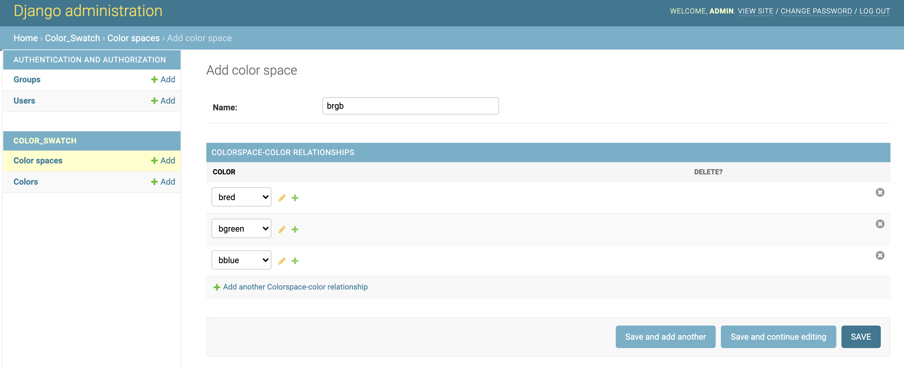
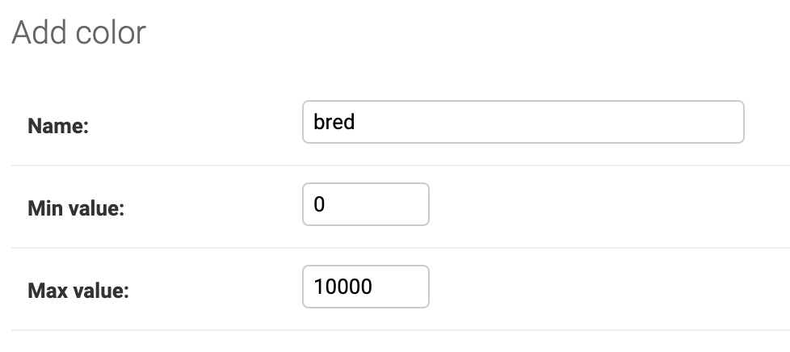

# Add new color space

It is easy to add new color space by following below steps:
1. login to django admin page(username and password are "admin") to add new colors and color spaces:

   
   

2. the data of new color space returned to frontend is with same structure as others, so you will need to add your frontend code for supporting rendering the new color space on webpage.